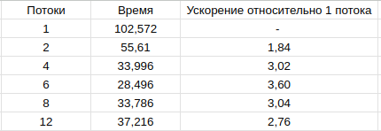

# TASK 1. Библиотека OpenMP

Давайте рассмотрим книгу В. П. Гергеля “Высокопроизводительные вычисления для
многоядерных многопроцессорных систем” (2010). В главе 11 "Решение
дифференциальных уравнений в частных производных", описывающей проблему
численного решения задачи Дирихле для уравнения Пуассона, содержится алгоритм
11.6 (Блочный подход к методу волновой обработки данных) её решения, который
может быть эффективно распараллелен при помощи OpenMP.

В первой части задания вам следует просто разобраться в этом алгоритме и
реализовать его. Обратите внимание, что он возникает итерационно. Например,
алгоритм 11.2 является корректным, но распараллеливание приводит к замедлению в
25 раз вместо ускорения.

Вторая часть задания — провести численный эксперимент, исследующий
эффективность (или неэффективность) параллельной версии. Модельные краевые
задачи необходимо выбрать самостоятельно, исходя из того, что вы хотели бы теми
или иными экспериментами продемонстрировать. Это наиболее сложная часть
задания.

    Комментарии:
        1) Эта задача относится главным образом не к вычислительной математике, поскольку численный метод здесь весьма прост, а к параллельному программированию. Здесь можно проследить, как, зная специфику предметной области (в данном случае — метода решения уравнения), можно как весьма эффективно, так и совершенно неэффективно организовать параллелизм по данным.
        2) В качестве документации по OpenMP, снабжённой комментариями, можно использовать главу 5 ("Параллельное программирование с использованием OpenMP") той же книги или любые другие источники.

# Характеристики вычислительных машин
Необходимые характеристики первого устройства: 

OS: `Ubuntu 23.10`  
CPU: `Intel(R) Core(TM) i5-10500H CPU @ 2.50GHz`

Необходимые характеристики второго устройства:

OS: `Kali GNU\Linux Rolling`  
CPU: `Intel(R) Core(TM) i5-2410M CPU @ 2.30GHz`

# Первая часть задания

Реализован алгоритм 11.6 из предложенной книги 

# Входные и теоретические данные

Выполняя вторую часть задания, проведем численный эксперимент. 
Будем исследовать зависимость скорости выполнения от количества потоков. Количество потоков, которое будет использованно в эксперименте: 
1, 2, 4, 6, 8, 12  
Размер сетки: 1000 

Вычисления будут проводится для: 

 - $u(x,y) = 500 * x^4 + 750 * x^3 + 210 * y^2 +x * y + 2000$
 - $f(x,y) = 6000 * x^2 + 4500 * x + 422$

На каждом устройстве вычисления будут проводиться по 5 раз 

Введем несколько обозначений, которые нам необходимы для того, чтобы посчитать теоретическое ускорение
- $t_n$ - время выполнения в условных единицах на $n$ потоках 
- $t_0$ - время в условных единицах, которое занимают сами вычисления 
- $BLOCK\_SIZE$ - размер блока
- $iter$ - количество итераций внешнего цикла
- $ceil(x)$ - округлить $x$ в большую сторону 
- $BLOCK\_NUM$ = $ceil(N+2 / BLOCK\_SIZE)$ - необходимое кол-во блоков

\
\
$t_0 \approx C*BLOCK\_SIZE^2,\ C_1 \in R$

$t_1 \approx 
iter*( 
    t_0*BLOCK\_NUM^2 + C_2*BLOCK\_NUM),
    \ c \in R $

$t_n \approx 
iter*( 
    \displaystyle\sum_{i=1}^{BLOCK\_NUM-1}
    t_0*ceil(i/n) +
    \displaystyle\sum_{i=1}^{BLOCK\_NUM}
    t_0*ceil(i/n)
    + C_2*BLOCK\_NUM)$ 
    
$ = iter*(  
    2*t_0*\displaystyle\sum_{i=1}^{BLOCK\_NUM-1}
    ceil(i/n) +  
    t_0*ceil(BLOCK\_NUM/n) + C_2*BLOCK\_NUM),
    \ C_2 \in R$

Ожидается: 
 - Ускорение программы, согласно вычислениям выше 
 - Уменьшение времени работы с увеличением числа потоков 

# Теоретические ожидания

Теоретическое ускорение представлено здесь result/expected_result.png
и для удобства приведено в таблице ниже

 

# Результаты исследования 

Все результаты отображены в папке result

Результаты запуска на первой машине приведены ниже в таблице 

 

Результаты запуска на второй машине приведены ниже в таблице

# Оценка результатов

Ускорение произошло, но на двух устройствах по разному.  
\
\
Первое устройство выдало результаты в основном превышающие ожидаемые. Но при этом
результат при данной сетке и при 8 потоках согласуется с тем, что было получено в книге. 

Также довольно интересно, что ускорение происходило лишь вплоть до 6 потоков, а 
8 потоков по времени исполнения практически сравнились с 4. Количество ядер на этом процессоре - 6, 
потоков - 12
\
\
На втором устройстве результаты оценить сложнее, из-за того, что 2 ядра и 4 потока, 
но все же на 4 потоках, несмотря на всё, распараллеливание вызвало замедление, вопреки ожиданиям.
При большем количестве потоков - время работы сравнимо с временем работы на 2. 
Вполне вероятно, что замедление вызвано старой моделью процессора, но найти потдверждений этому я, 
к сожалению, не смог и это остается лишь предположением. Я нахожу это необычным
\
\
Также были проведены несколько тестов на первом устройстве при количестве потоков превышающих 12, но из результаты я не стал прикреплять.
Они показали, что при последующем увеличении потоков, ускорение лишь уменьшается, в какой-то момент просто сравнявшись с последовательным 
исполнением 

Скорее всего, сильная разница между ожидаемым и практическим ускорением такая большая разница из-за того, 
что способ подсчета теоретического ускорения не учитывает характеристики процессора, и ещё множество факторов.

# Выводы

Из полученных результатов можно сделать следующие выводы: 

1) Рассчитать ускорение в общем случае - довольно сложно 
2) Сложно однозначно утверждать из-за недостатка данных, но увеличение количества потоков, имеет смысл до тех пор пока 
кол-во потоков не сравняется с количеством ядер на процессоре 
3) Расспараллеливание данного алгоритма может не только ускорять, но и замедлять при особых условиях 
4) Очень сильно влияет устройство на котором будет запускаться программа 
