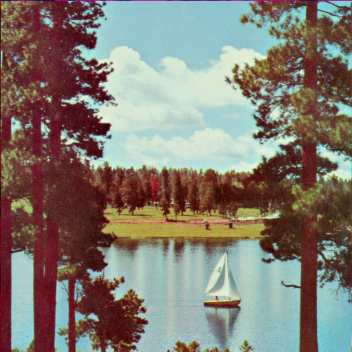
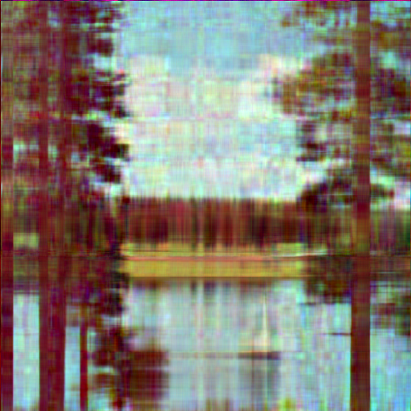
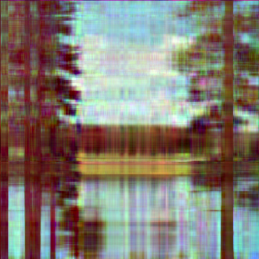
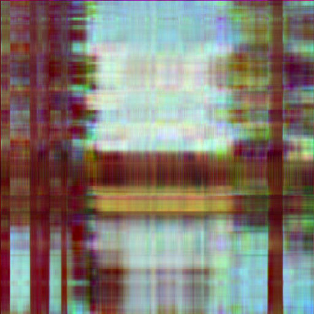
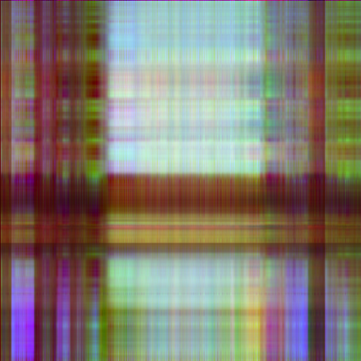
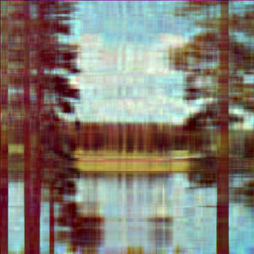
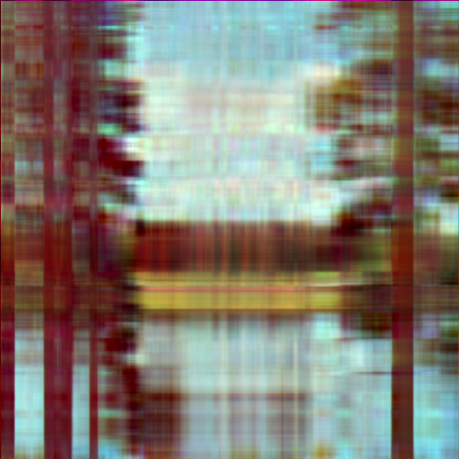
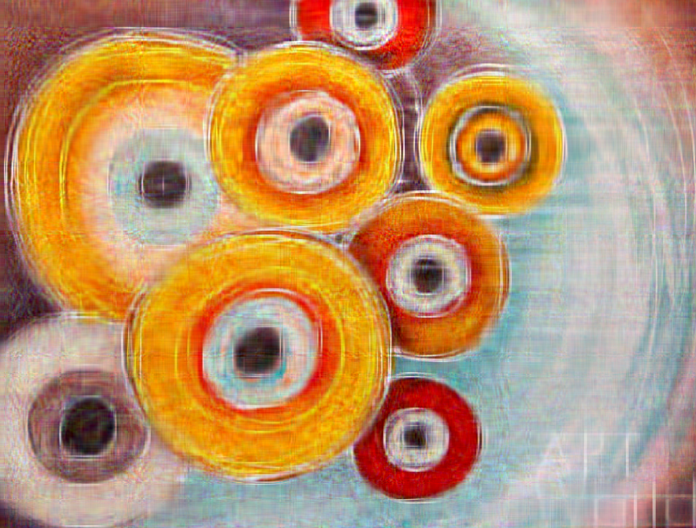
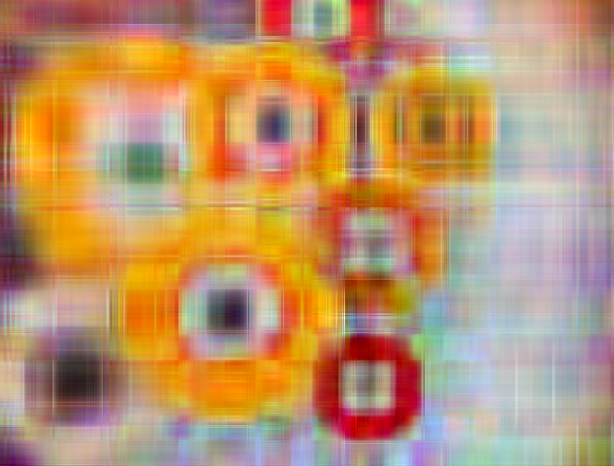
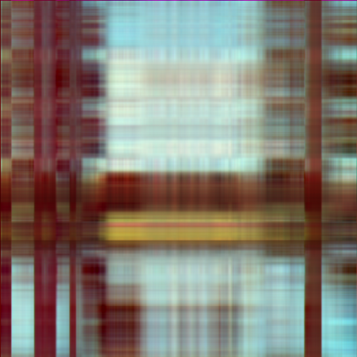

# Task 3. Сингулярное разложение и сжатие изображений

# Часть I
Реализуйте программу на языке Python, которая производит сжатие изображения в формате bmp (24 бита на цвет) с минимизацией потери качества при фиксированном ограничении на размер сжатого файла, используя теорию малоранговых приближений. Ваша программа должна семантически распадаться на две единицы логики: формирование промежуточного представления на основе исходного изображения, а также восстановление, использующее промежуточное представление.

Для хранения промежуточного сжатого представления используйте собственный формат файла; его размер (включая область метаданных) должен быть в хотя бы в N раз меньше исходного, где N – настраиваемый параметр. Напишите краткую документацию предложенного вами формата и приложите её к решению задачи.

Сингулярное разложение реализуйте тремя способами:
- пользуясь стандартными библиотеками
- с помощью самописного примитивного алгоритма
- “максимально хорошим” численным методом, который у вас получится написать

Обратите внимание, что даже в рамках стандартных библиотек Python есть две реализации SVD.
Можно попробовать обратиться к исходному коду, описаниям реализации и исходя из этого
подумать о частных случаях, позволяющих улучшать качество.

Роль примитивного алгоритма могут выполнять, например, степенной метод или какой-то из
описанных в пособии Дж Голуб, Ч. ван Лоун "Матричные вычисления." – Москва: Мир, 1999.

Приведу также пару статей, в которых излагаются современные подходы к решению задачи, но это
вовсе не значит, что вам нужно и даже стоит использовать именно их.
- https://core.ac.uk/download/pdf/82260137.pdf
- https://www.degruyter.com/document/doi/10.1515/jisys-2018-0034/html

# Часть II
Подберите достаточно большое изображение, на котором будет (насколько это возможно видна) разница в сохранности или потере ключевых признаков при его сжатии в одинаковое количество раз при использовании различных реализаций SVD.

Возможно, эта задача не решится путём подбора изображения. Тогда следует отталкиваться от того, какие матрицы каким алгоритмом лучше обрабатывать. То есть рассматривать матрицу как первичный объект, а построенное на его основе изображение — как вторичный. Ещё можно наложить дополнительные ограничения: например, предоставить различным алгоритмам одинаковое время работы.

# Ход работы

1) Проверить простейший алгоритм на разных степенях сжатия 
2) Проверить алгоритм numpy на разных степях сжатия 
3) Проверить наиболее эффективный алгоритм, который получится реализовать на разных степенях сжатия 
4) Оценить разницу работы этих алгоритмов 

# Подопытные 

| Lake  | Lenna  |  Wenger  |
|-------|--------|----------|
|  |  | |

# Сжатие на простейшем алгоритме 

Сжатие на простом алгоритме будет производиться только для одной картинки, потому что сжатие бОльших по размеру картинок занимает непростительно много времени. (я не смог дождаться кругов Венгера на x2, потому что это длилось более часа)

| x2  | x3  |  x5  | x10  | 
|-------|--------|----------|----------|
|  |  | |  | 

# Сжатие с помощью numpy

Сожмем Lake.bmp

| x2  | x3  |  x5  | x10  | 
|-------|--------|----------|----------|
|  |  | |  |

Теперь круги Венгера 

| x2  | x3  |  x5  | x10  | 
|-------|--------|----------|----------|
|  |  | |  |

И напоследок

| x2  | x3  |  x5  | x10  | 
|-------|--------|----------|----------|
|  |  | |  |

# Сжатие с помощью advanced алгоритма 

Повторим тоже для  advanced алгоритма 

| x2  | x3  |  x5  | x10  | 
|-------|--------|----------|----------|
|  |  | |  |

| x2  | x3  |  x5  | x10  | 
|-------|--------|----------|----------|
|  |  | |  |

| x2  | x3  |  x5  | x10  | 
|-------|--------|----------|----------|
|  |  | |  |

# Вывод

- Простейших алгоритм занимает невероятно много времени и его использования для картинок большого размера - дурная затея 
- По сравнения с numpy и advanced, простой алгоритм потерял очень много цветов 
- Разница между numpy и advanced реализацией не такая значительная и в по времени интуитивно разница не слишком большая 